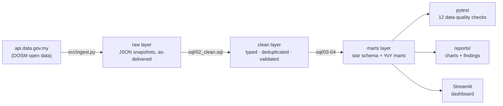
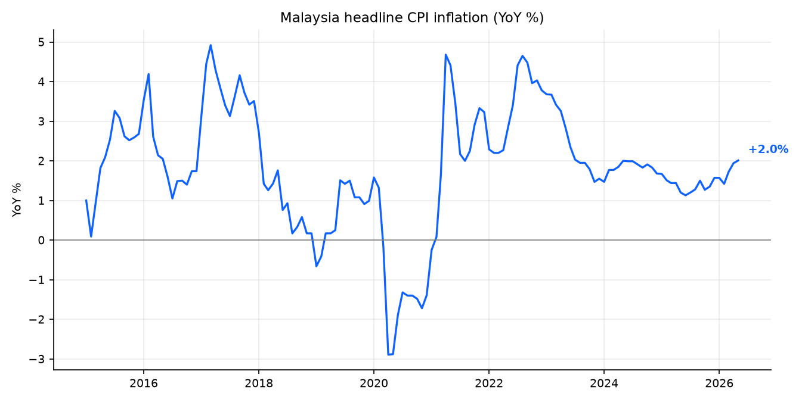
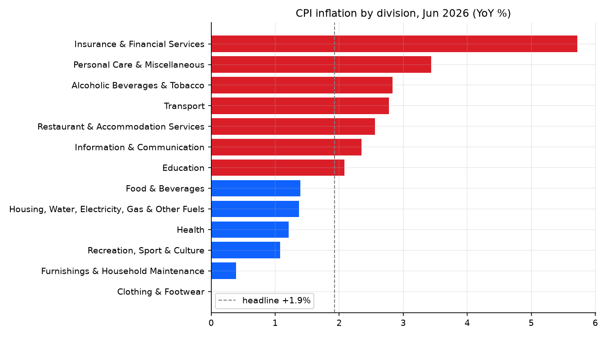
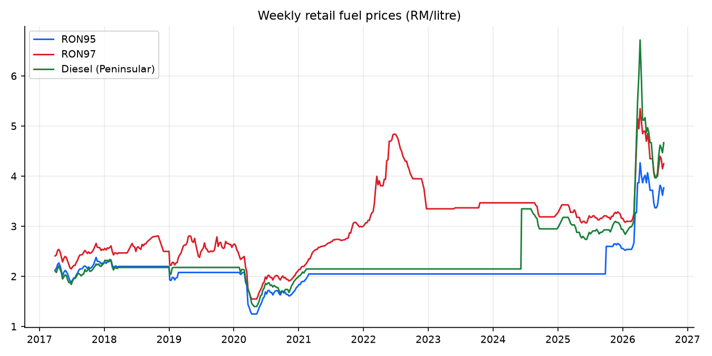
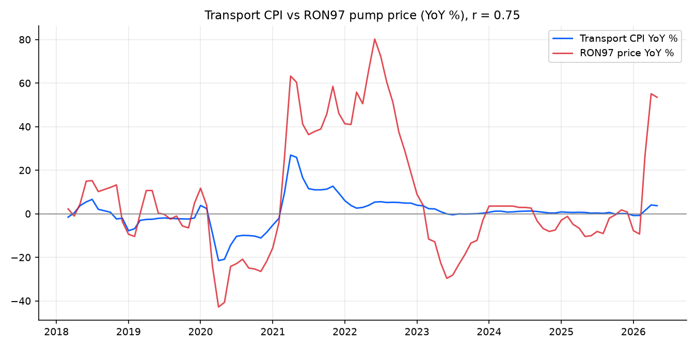
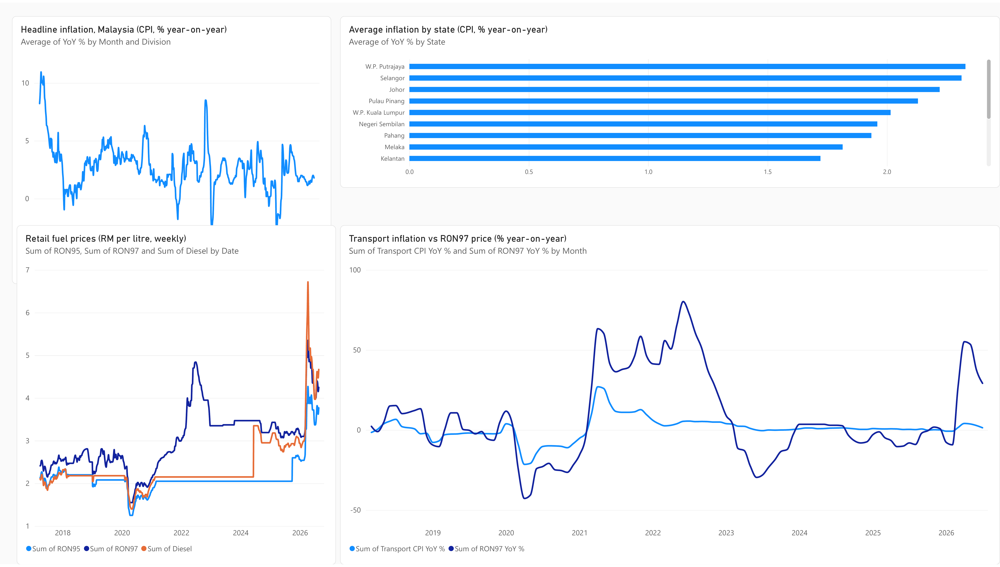

# 🇲🇾 Malaysia Open Data Pipeline


An end-to-end **ELT pipeline, dimensional warehouse, and dashboard** built on
official Malaysian government open data — monthly **CPI** (national, by state,
by COICOP division) and weekly **retail fuel prices** from the Department of
Statistics Malaysia via [data.gov.my](https://data.gov.my).



The warehouse follows the **raw → clean → marts** (medallion) pattern used on
production data platforms, in a single portable DuckDB file. The SQL is
standard enough to port to **BigQuery** or Snowflake — swap `read_json_auto`
for an external table and the window functions run unchanged.

## Star schema

```
dim_date ────< fact_cpi_national >──── dim_division (COICOP 01–13)
dim_date ────< fact_cpi_state    >──── dim_division, dim_state (16 states)
dim_date ────< fact_fuel_price
```

Analysis marts are built on top with window functions
(`LAG(cpi_index, 12) OVER (PARTITION BY ...)` for year-over-year inflation):
`cpi_yoy_national`, `cpi_yoy_state`, `fuel_monthly`, `transport_vs_fuel`.

## Key findings (June 2026, latest release)

| Question | Finding |
|---|---|
| Where is inflation now? | Headline CPI **+1.9% YoY** — modest, but masking a wide spread |
| What's driving it? | **Insurance & Financial Services (+5.7%)** runs hottest, then Personal Care (+3.4%) and Transport (+2.8%); Clothing & Footwear is flat (0.0%) |
| Is inflation uniform across Malaysia? | No — **Pahang +2.6%** vs **Sarawak +0.4%** in the same month |
| Do pump prices move the transport CPI? | Partly: **Pearson r = 0.74** between transport-CPI YoY and RON97-price YoY (99 monthly observations). Correlating *year-over-year changes* rather than price levels avoids the spurious co-trending two rising series would otherwise show |
| Is the fuel-subsidy regime visible in the data? | Yes — RON95 sat at **exactly RM 2.05 for 242 weeks** (all of 2023), then unpegged: it ranges **RM 2.52–4.27 across 2026**. Market-priced diesel peaked at **RM 6.72/L** (9 Apr 2026) |

Auto-generated details: [`reports/summary.md`](reports/summary.md).

| | |
|---|---|
|  |  |
|  |  |

## Power BI dashboard



A four-visual Power BI report built on this warehouse: headline CPI inflation
back to 1981, average inflation by state, weekly retail fuel prices, and the
transport-CPI-vs-RON97 comparison. Exported view:
[`powerbi/screenshots/dashboard.pdf`](powerbi/screenshots/dashboard.pdf).

The report connects to the CSVs below by **raw HTTPS URL**, not to a local
file, so it refreshes straight from this repository and anyone can rebuild it
without a database or a gateway.

## BI-tool exports (Power BI / Tableau)

`powerbi/export_for_powerbi.py` flattens the marts into four CSVs that are
committed to this repo, so a BI tool can consume them straight over HTTPS
without a database or a gateway:

| Table | Raw URL |
|---|---|
| National CPI by division | [`powerbi/cpi_national.csv`](powerbi/cpi_national.csv) |
| CPI by state | [`powerbi/cpi_state.csv`](powerbi/cpi_state.csv) |
| Weekly fuel prices | [`powerbi/fuel_prices.csv`](powerbi/fuel_prices.csv) |
| Transport CPI vs RON97 | [`powerbi/transport_vs_fuel.csv`](powerbi/transport_vs_fuel.csv) |

In Power BI: **Get data → Text/CSV → Link to file**, then paste the raw
`raw.githubusercontent.com` URL for any of the four with *Anonymous*
authentication. The report then refreshes directly from this repository.

## Data quality

`tests/test_data_quality.py` runs **12 pytest checks** across five families —
the checks a production pipeline runs after every load:

- **Completeness** — minimum row counts per table, all 16 states present, every division mapped
- **Uniqueness** — natural keys are unique in every clean table
- **Validity** — CPI index and pump prices within plausible ranges
- **Referential integrity** — every fact row joins to all its dimensions
- **Continuity & freshness** — no month gaps in the national series; data is recent

One check earned its keep during development: the fuel-price validity range
originally capped diesel at RM 6/L and **failed** on the week of 9 Apr 2026
(RM 6.72/L). Investigating the failure showed the value was genuine — it
matches the official series and the surrounding weeks (RM 6.02, 5.97, 5.12) —
so the bound was widened to RM 8 and the reason recorded in the test. That is
the point of the suite: it forces you to explain an outlier before accepting
it, rather than silently ingesting it.

## Run it

```bash
pip install -r requirements.txt

python src/ingest.py            # refresh from api.data.gov.my (optional — snapshots committed)
python src/build_warehouse.py   # build data/warehouse.duckdb (raw → clean → marts)
pytest                          # 12 data-quality checks
python src/report.py            # charts + auto-filled findings report

streamlit run app/dashboard.py  # interactive dashboard
```

Works fully **offline** on the committed raw snapshots — `ingest.py` only
refreshes them when the API is reachable.

## Structure

```
├── src/
│   ├── ingest.py            # API → data/raw/*.json.gz (bronze)
│   ├── build_warehouse.py   # executes sql/ in order → warehouse.duckdb
│   └── report.py            # charts + reports/summary.md
├── sql/
│   ├── 01_load_raw.sql      # raw layer
│   ├── 02_clean.sql         # typed, deduplicated, range-validated
│   ├── 03_star_schema.sql   # dims + facts
│   └── 04_marts.sql         # YoY inflation marts (window functions)
├── tests/
│   └── test_data_quality.py # 12-check pytest suite
├── app/
│   └── dashboard.py         # Streamlit + Altair
└── data/raw/                # committed API snapshots (~220 KB gzipped)
```

## Data sources

| Dataset | Grain | Coverage |
|---|---|---|
| [`cpi_headline`](https://data.gov.my/data-catalogue/cpi_headline) | month × division | 1980 – present |
| [`cpi_state`](https://data.gov.my/data-catalogue/cpi_state) | month × state × division | 2010 – present |
| [`fuelprice`](https://data.gov.my/data-catalogue/fuelprice) | week × fuel type | 2017 – present |

Licensed under the [Malaysian Government Open Data licence](https://data.gov.my/terms);
this project is not affiliated with DOSM.
