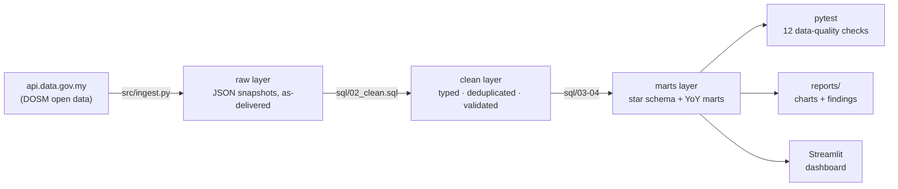

# 🇲🇾 Malaysia Open Data Pipeline


An end-to-end **ELT pipeline, dimensional warehouse, and dashboard** built on
official Malaysian government open data — monthly **CPI** (national, by state,
by COICOP division) and weekly **retail fuel prices** from the Department of
Statistics Malaysia via [data.gov.my](https://data.gov.my).



The warehouse follows the **raw → clean → marts** (medallion) pattern used on
production data platforms, in a single portable DuckDB file. The SQL is
standard enough to port to **BigQuery** or Snowflake — swap `read_json_auto`
for an external table and the window functions run unchanged.

## Star schema

```
dim_date ────< fact_cpi_national >──── dim_division (COICOP 01–13)
dim_date ────< fact_cpi_state    >──── dim_division, dim_state (16 states)
dim_date ────< fact_fuel_price
```

Analysis marts are built on top with window functions
(`LAG(cpi_index, 12) OVER (PARTITION BY ...)` for year-over-year inflation):
`cpi_yoy_national`, `cpi_yoy_state`, `fuel_monthly`, `transport_vs_fuel`.

## Key findings (May 2026 data)

| Question | Finding |
|---|---|
| Where is inflation now? | Headline CPI **+2.0% YoY** — modest, but masking a wide spread |
| What's driving it? | **Insurance & Financial Services (+4.9%)** and **Transport (+3.8%)** run hottest; Clothing is deflating (−0.1%) |
| Is inflation uniform across Malaysia? | No — **Pahang +2.8%** vs **Sarawak +0.5%** in the same month |
| Do oil shocks hit consumers? | Only partly: RON97-price YoY vs transport-CPI YoY correlate at **r = 0.75**, but the administered RON95 cap visibly dampens the pass-through |
| Subsidy rationalisation in the data | Post-2024 targeted-subsidy era is clearly visible: market diesel peaked at **RM 6.72/L** (Apr 2026) while capped RON95 held near RM 2.05 until the BUDI95 restructure |

Auto-generated details: [`reports/summary.md`](reports/summary.md).

| | |
|---|---|
|  |  |
|  |  |

## Data quality

`tests/test_data_quality.py` runs **12 pytest checks** across five families —
the checks a production pipeline runs after every load:

- **Completeness** — minimum row counts per table, all 16 states present, every division mapped
- **Uniqueness** — natural keys are unique in every clean table
- **Validity** — CPI index and pump prices within plausible ranges
- **Referential integrity** — every fact row joins to all its dimensions
- **Continuity & freshness** — no month gaps in the national series; data is recent

One check earned its keep during development: the fuel-price validity range
originally capped at RM 6/L and **correctly failed** on real Apr 2026 diesel
prices (RM 6.72) — a policy change (subsidy rationalisation), not bad data,
so the rule was updated and documented.

## Run it

```bash
pip install -r requirements.txt

python src/ingest.py            # refresh from api.data.gov.my (optional — snapshots committed)
python src/build_warehouse.py   # build data/warehouse.duckdb (raw → clean → marts)
pytest                          # 12 data-quality checks
python src/report.py            # charts + auto-filled findings report

streamlit run app/dashboard.py  # interactive dashboard
```

Works fully **offline** on the committed raw snapshots — `ingest.py` only
refreshes them when the API is reachable.

## Structure

```
├── src/
│   ├── ingest.py            # API → data/raw/*.json.gz (bronze)
│   ├── build_warehouse.py   # executes sql/ in order → warehouse.duckdb
│   └── report.py            # charts + reports/summary.md
├── sql/
│   ├── 01_load_raw.sql      # raw layer
│   ├── 02_clean.sql         # typed, deduplicated, range-validated
│   ├── 03_star_schema.sql   # dims + facts
│   └── 04_marts.sql         # YoY inflation marts (window functions)
├── tests/
│   └── test_data_quality.py # 12-check pytest suite
├── app/
│   └── dashboard.py         # Streamlit + Altair
└── data/raw/                # committed API snapshots (~220 KB gzipped)
```

## Data sources

| Dataset | Grain | Coverage |
|---|---|---|
| [`cpi_headline`](https://data.gov.my/data-catalogue/cpi_headline) | month × division | 1980 – present |
| [`cpi_state`](https://data.gov.my/data-catalogue/cpi_state) | month × state × division | 2010 – present |
| [`fuelprice`](https://data.gov.my/data-catalogue/fuelprice) | week × fuel type | 2017 – present |

Licensed under the [Malaysian Government Open Data licence](https://data.gov.my/terms);
this project is not affiliated with DOSM.
