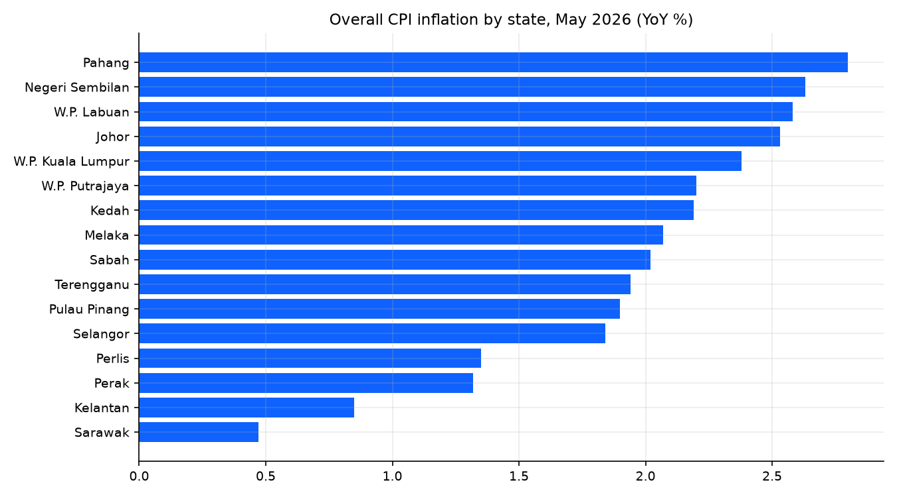

# Findings summary

_Auto-generated by `src/report.py` on 2026-07-05 from `data/warehouse.duckdb`._

## Latest reading: May 2026

| Indicator | Value |
|---|---|
| Headline CPI inflation (YoY) | **+2.0%** |
| Hottest division | **Insurance & Financial Services** (+4.9%) |
| Coolest division | **Clothing & Footwear** (-0.1%) |
| Highest-inflation state | **Pahang** (+2.8%) |
| Lowest-inflation state | **Sarawak** (+0.5%) |
| RON97 pump price (01 Jul 2026) | RM 4.00/litre |

## Transport CPI vs pump prices

Correlation between transport-CPI YoY and RON97-price YoY (2018-present):
**r = 0.75**. Market-priced RON97 moves with global oil, while the
administered RON95 price cap means headline transport inflation is largely
insulated from oil shocks -- visible as RON97 swinging far more than the
transport CPI line.

## Charts

